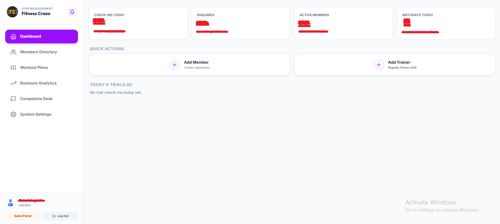
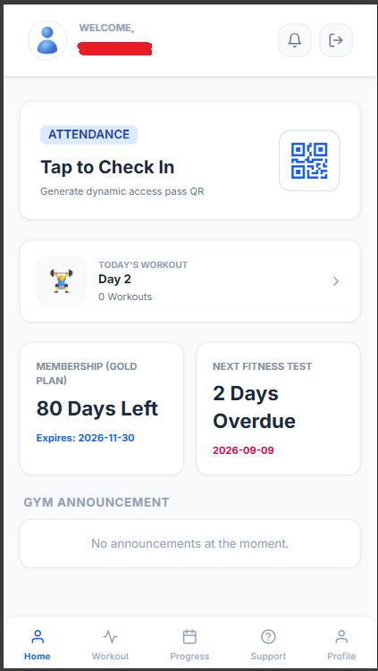
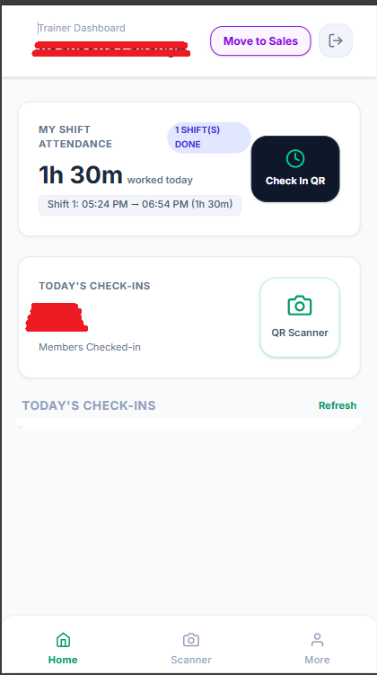
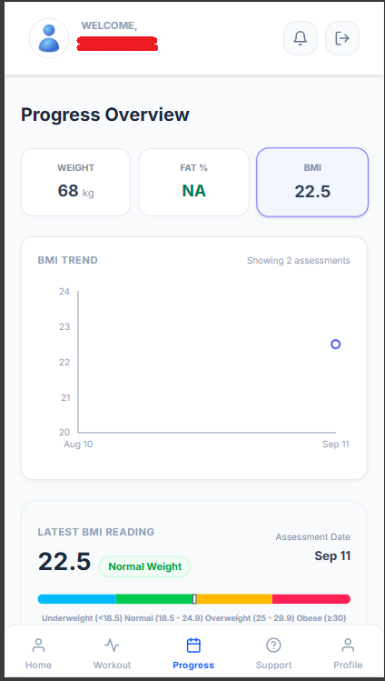
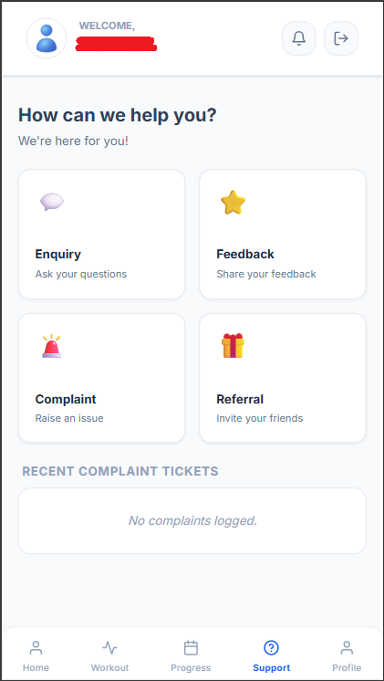

# FitnessCraze

## Production PWA for Gym & Fitness Center Operations

**Project Type:** Freelance / Client Project

**Application:** Progressive Web App (PWA)

**Status:** Production

**Source Code:** Private — Production Client Code

---

## 1. Overview

**FitnessCraze** is a full-stack gym management and operating platform designed to digitize the day-to-day operations of fitness centers.

The platform brings together gym owners, trainers, reception/sales staff, and members into a single system.

Instead of relying on paper attendance sheets, physical membership cards, WhatsApp workout plans, and disconnected sales records, FitnessCraze provides a centralized digital workflow for attendance, workouts, member management, sales leads, analytics, and operational monitoring.

The application is designed as a mobile-friendly Progressive Web App, allowing users to access the system from smartphones, tablets, and computers without requiring a traditional native mobile application.

---
# 2. Project Highlights

- 📱 Production Progressive Web App
- 👥 Role-based access for owners, trainers, reception/sales staff, and members
- 📷 Time-bound QR-based gym attendance
- 🏋️ Digital workout planning and assignment
- 📊 Member fitness progress and assessment tracking
- 💼 Lead management and sales pipeline
- 📈 Owner-level operational analytics
- 🛟 Member support workflows
- 🔐 JWT-based authentication and role-based authorization
- 🐳 Dockerized production deployment
- 🌐 VPS deployment with Nginx
- 🗄️ MySQL relational database

---

# 3. The Problem

Traditional gym operations often depend on a mixture of:

* Paper attendance registers
* Physical membership cards
* Manually maintained workout plans
* WhatsApp communication between trainers and members
* Notebook-based sales leads
* Manual follow-up tracking
* Limited visibility into current gym occupancy
* Disconnected operational data

These workflows can make it difficult for gym owners to maintain accurate attendance, manage trainers, follow up with prospective members, and understand what is happening inside the gym in real time.

FitnessCraze was designed to bring these workflows into one digital platform.

---

# 4. The Solution

FitnessCraze provides separate experiences based on the user's role:

### Gym Owner

* Business and operational dashboard
* Member and staff management
* Attendance visibility
* Revenue and growth metrics
* Lead management
* Audit information

### Trainer

* Member QR scanning
* Live gym occupancy
* Workout program creation
* Exercise library management
* Member workout management

### Reception / Sales

* Prospect and lead capture
* Lead pipeline
* Lead status management
* Follow-up activity tracking
* Member registration

### Member

* Digital gym pass
* QR-based check-in
* Exit checkout
* Daily workout routines
* Progress tracking
* Feedback and complaints

The system implements four primary roles: `OWNER`, `TRAINER`, `RECEPTIONIST/SALES`, and `MEMBER`.

---

# 5. Key Features

## 4.1 Dynamic QR Attendance

One of the core features is the digital gym access system.

Members generate a time-bound QR pass from their device. The QR token expires after two minutes, reducing the usefulness of screenshots or previously captured passes.

When a trainer scans the pass, the backend validates the token and applies attendance rules before recording the check-in.

The system also prevents duplicate same-day check-ins and supports audited administrative overrides when required.

### Attendance flow

```text
Member
   ↓
Generates temporary QR pass
   ↓
Trainer scans QR using device camera
   ↓
Backend validates token
   ↓
Attendance rules checked
   ↓
Check-in recorded
   ↓
Live occupancy updated
```

Members can also perform an exit checkout using the application's scanning flow, allowing the system to track active sessions and session duration.

---

# 6. Digital Workout Management

FitnessCraze replaces manually written workout cards with structured digital workout programs.

Trainers can create and assign programs containing:

* Exercises
* Sets
* Repetitions
* Weight targets
* Tempo
* Rest periods
* Progression levels

Members can then access their assigned routines directly from their device.

The workout system is built around a hierarchical structure of workout templates, levels, days, prescriptions, and exercises.

---

# 7. Member Experience

The member portal provides a mobile-first experience for common gym activities.

Members can access:

* Digital gym pass
* Attendance functionality
* Exit checkout
* Daily workout routines
* Workout progress
* Body measurement tracking
* Personal records
* Feedback and service requests

Progress information is visualized through interactive charts, allowing members to track changes over time.

---

# 8. Sales & Lead CRM

FitnessCraze also includes a lightweight CRM for gym enquiries.

Reception and sales staff can capture prospective members and manage them through a Kanban-style pipeline.

Lead statuses include:

`Hot → Warm → Cold → Converted`

The system also provides lead details and activity tracking so prospects don't depend entirely on paper notes or memory.

The Sales Portal implements this workflow through a dedicated lead management interface.

---

# 9. Owner Dashboard

The owner portal provides a centralized operational view of the gym.

It includes functionality for:

* Member management
* Staff management
* Attendance monitoring
* Live occupancy
* Sales leads
* Revenue-related metrics
* Operational analytics
* Audit information

The goal is to give gym owners a single place to understand what is happening across the business.

---

# 10. Technical Architecture

FitnessCraze uses a decoupled client-server architecture.

```text
                    ┌─────────────────────┐
                    │   Member / Staff    │
                    │ Phone / Tablet / PC │
                    └──────────┬──────────┘
                               │
                               │ HTTP / REST
                               ▼
                    ┌──────────────────────┐
                    │        Nginx         │
                    │ Reverse Proxy/Gateway│
                    └──────────┬───────────┘
                               │
                    ┌──────────┴──────────┐
                    │                     │
                    ▼                     ▼
          ┌─────────────────┐   ┌──────────────────┐
          │ React Frontend  │   │ Spring Boot API  │
          │     PWA/SPA     │   │     Backend      │
          └─────────────────┘   └────────┬─────────┘
                                         │
                                         │ JPA/Hibernate
                                         ▼
                                ┌──────────────────┐
                                │    Database      │
                                │      MySQL       │
                                └──────────────────┘
```

The frontend communicates with the backend through REST APIs, while Nginx acts as the production reverse proxy between the client, frontend assets, and API services.

---

# 11. Technology Stack

## Frontend

* React 18
* Vite
* Tailwind CSS
* Recharts
* Lucide React / React Icons
* html5-qrcode
* Browser camera APIs

## Backend

* Java 17
* Spring Boot 3
* Spring Security
* JJWT
* Spring Data JPA
* Hibernate
* Maven
* Jackson
* Lombok

## Database

* MySQL
* H2 for development/testing

## Infrastructure

* Docker
* Docker Compose
* Nginx
* VPS deployment

The documented frontend and backend stack is based on React/Vite and Spring Boot respectively, with JPA/Hibernate handling persistence and browser-based QR scanning handled through `html5-qrcode`.

---

# 12. Security

Security was an important part of the application architecture.

## Authentication

FitnessCraze uses an access-token and refresh-token model.

The documented implementation uses:

* Short-lived JWT access tokens
* Long-lived refresh tokens
* Refresh token rotation
* Token revocation
* Reuse detection
* Password recovery tokens

The access token carries user identity, roles, and permission information, while refresh tokens are tracked server-side.

## Role-Based Access Control

Different users receive different capabilities based on their role.

For example:

```text
OWNER
 ├── User management
 ├── Analytics
 ├── Audit access
 └── Operational controls

TRAINER
 ├── QR scanning
 ├── Occupancy
 └── Workout management

RECEPTIONIST / SALES
 ├── Lead management
 └── Member registration

MEMBER
 ├── Gym pass
 ├── Workouts
 ├── Progress
 └── Feedback
```

The backend also uses granular permissions for operations such as user management, attendance viewing, and report access.

---

# 13. Database Architecture

The application uses a normalized relational database model.

Important areas include:

* Users and roles
* Permissions
* Refresh tokens
* Password reset tokens
* Login history
* Audit logs
* Attendance
* Attendance sessions
* Exercises
* Workout templates
* Workout levels
* Workout days
* Workout prescriptions

This structure separates authentication, authorization, attendance, auditability, and workout planning into dedicated data models.

---

# 14. REST API

The backend exposes REST APIs organized around application domains.

Examples include:

### Authentication

```text
POST /auth/login
POST /auth/logout
POST /auth/logout-all
POST /auth/refresh
POST /auth/forgot-password
POST /auth/reset-password
```

### User Management

```text
GET  /users/me
GET  /users
POST /users
PUT  /users/{id}
```

### Attendance

```text
GET  /member/attendance/qr-pass
POST /trainer/attendance/scan
POST /member/attendance/exit-checkout
POST /admin/attendance/force-checkout
```

### Workouts

```text
GET  /workouts/exercises
POST /workouts/templates
POST /workouts/assign
```

The API uses a consistent response structure containing success state, message, timestamp, data, and errors.

---

## 15. Deployment

The application is deployed on a VPS using containerized services.

The production environment consists of separate Docker containers:

```text
                    VPS
                     │
              ┌──────┴──────┐
              │    Nginx    │
              │ Reverse Proxy│
              └──────┬──────┘
                     │
          ┌──────────┴──────────┐
          │                     │
          ▼                     ▼
   React Frontend        Spring Boot Backend
                               │
                               ▼
                         MySQL Database
---md

# 16. Development Challenges

Building a real application for a client introduced challenges that are different from typical tutorial or college projects.

One example was the attendance workflow.

A simple attendance implementation might only record:

```text
Member → Check In
```

A production system needs to consider additional cases:

```text
Member
 ↓
Is the QR valid?
 ↓
Has it expired?
 ↓
Has this member already checked in today?
 ↓
Is this an authorized user?
 ↓
Should this be an administrative override?
 ↓
Record attendance
 ↓
Update active session / occupancy
```

This required thinking about business rules, security, edge cases, and the difference between a feature that merely works and a feature that works reliably in a real gym environment.

---

# 17. My Role

I worked on FitnessCraze as the primary developer for the client project, taking features from requirements through implementation, integration, testing and production deployment.

My responsibilities included:

* Understanding client requirements
* Designing and implementing frontend functionality
* Developing backend functionality and REST APIs
* Integrating frontend and backend
* Implementing authentication and authorization
* Building attendance workflows
* Implementing QR scanning
* Working with relational database models
* Handling production issues and edge cases
* Containerizing the application
* Deploying the application to a VPS
* Testing changes against real workflows
* Iterating based on client feedback

The project gave me experience taking software through the complete lifecycle:

**Requirement → Development → Integration → Deployment → Production**

---

# 18. Screenshots

The following screenshots showcase the production application across its
different user roles and workflows.

## Owner Dashboard



> Centralized gym operations dashboard providing visibility into attendance,
> enquiries, active members, business metrics and quick administrative actions.

## Member PWA



> Mobile-first Progressive Web App for members, providing digital gym access,
> today's workout, membership status, fitness test information and gym announcements.

## Trainer Portal



> Trainer-focused workflow for shift attendance, member check-ins and QR-based
> gym access validation.

## Progress Tracking



> Members can review fitness assessment information including weight, BMI,
> assessment history and visual progress trends.

## Member Support



> Dedicated member support workflows covering enquiries, feedback, complaints
> and referrals.


---

# 19. Why This Project Matters

FitnessCraze was an important step in my development as a software engineer because it moved beyond isolated coding exercises.

The project required balancing:

**Business requirements**
↓
**User experience**
↓
**Application architecture**
↓
**Security**
↓
**Database design**
↓
**Real-world edge cases**
↓
**Production deployment**

Working on a real client application also highlighted an important lesson:

> Building software is not finished when the code compiles.
> It is finished when the system reliably solves the problem it was built for.

---

# 20. Project Status

**Production Release:** FitnessCraze v1.0

**Repository:** Private production repository

The source code is intentionally not publicly available because the application contains production client code.

This document provides a high-level technical overview without exposing proprietary implementation details, credentials, private infrastructure information, or production source code.

---

## Disclaimer

FitnessCraze is a freelance client project.

Screenshots, branding, business information, and application details should only be published publicly with the client's permission.

Technical implementation details shown in this case study are intentionally limited to information suitable for a public portfolio.
